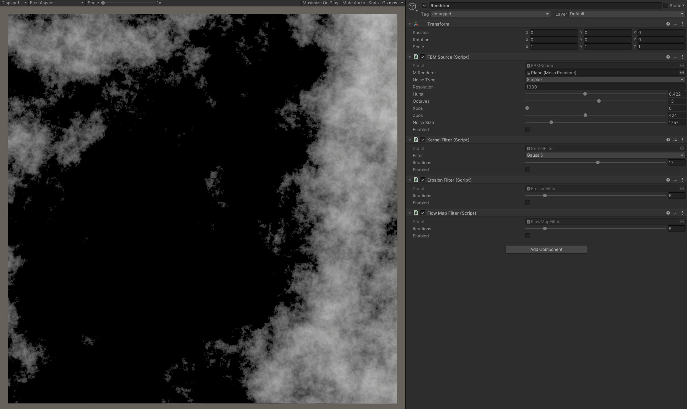
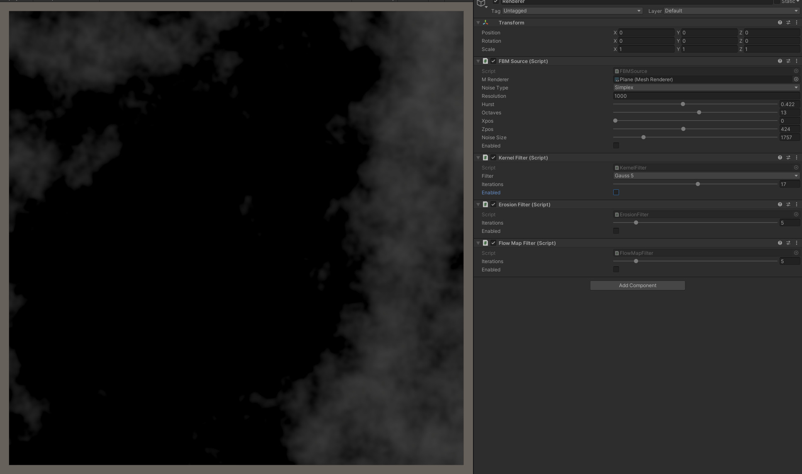
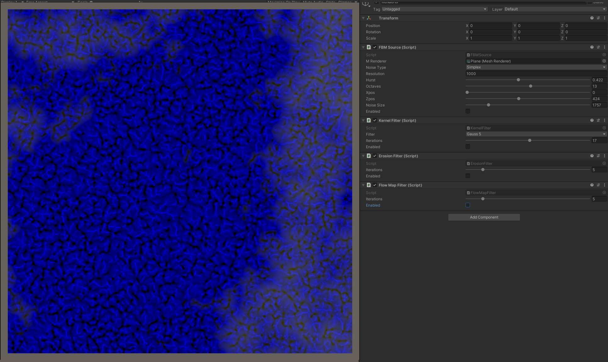
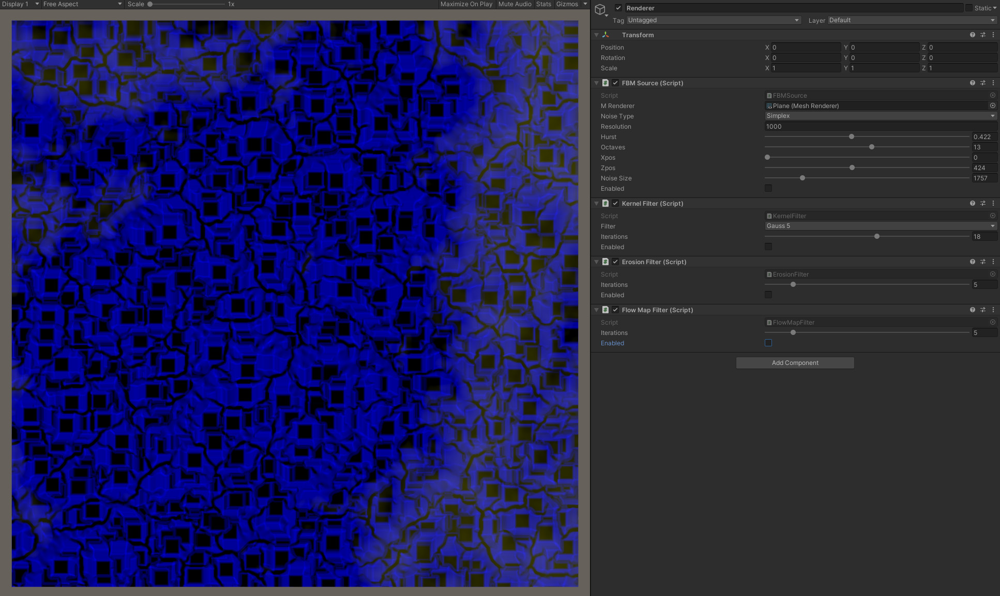
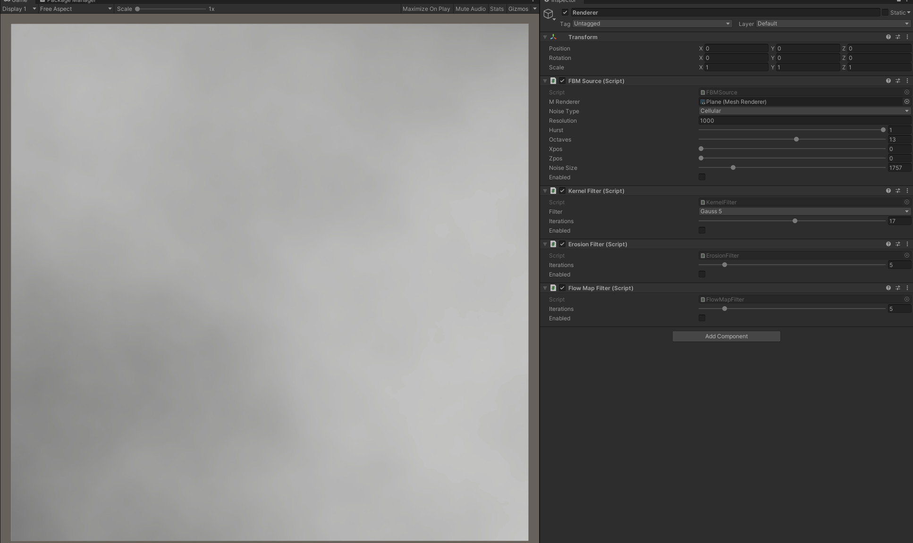
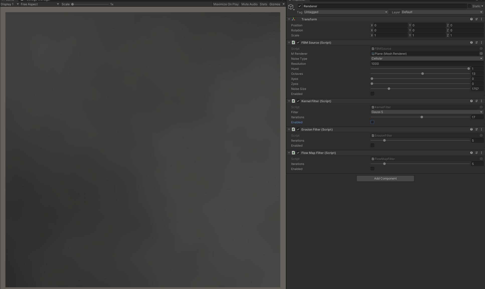
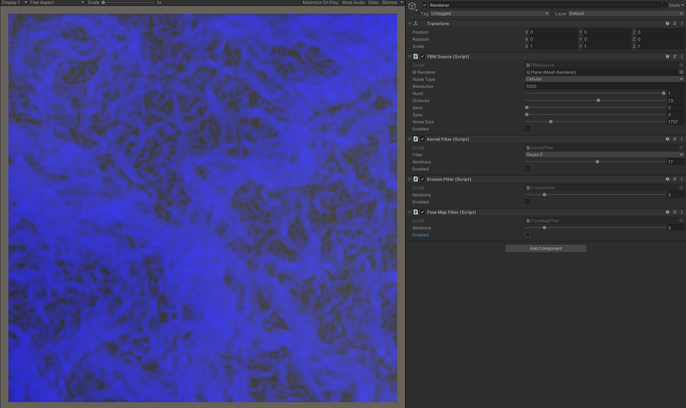

# noize-job
_2D noise generation, processing and meshing using Unity Jobs and Burst_  

### Current Features

#### Fractal Noise Generator with sources from SIMD noise sources (unity.mathematics)  
 - sin
 - perlin
 - periodic perlin
 - simplex
 - rotated simplex
 - cellular

#### Kernel Based Filtering
 - Gauss (3, 5)
 - Blur (3)
 - Sobel [broken] (3vert, 3 horz, 3 2D)
 - Value Erosion

#### Geologic Functions
 - Flow Map

### Examples

#### #1
Simplex basis (Hurst 0.4 13 octaves, noiseSize @ 1700)

Gauss 5 (17 iterations)

Flow Map

Value Erosion

#### #2
Cellular basis (Hurst 0.4 13 octaves noiseSize @ 1700x)

Gauss 5 (17 iterations)

Flow Map

